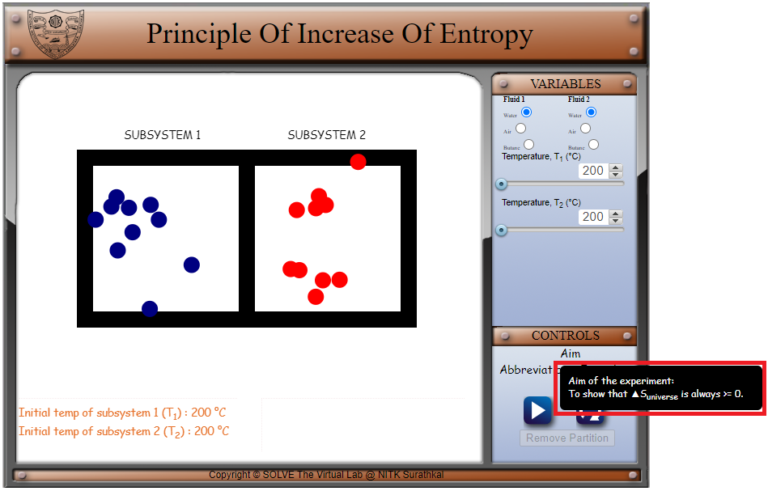
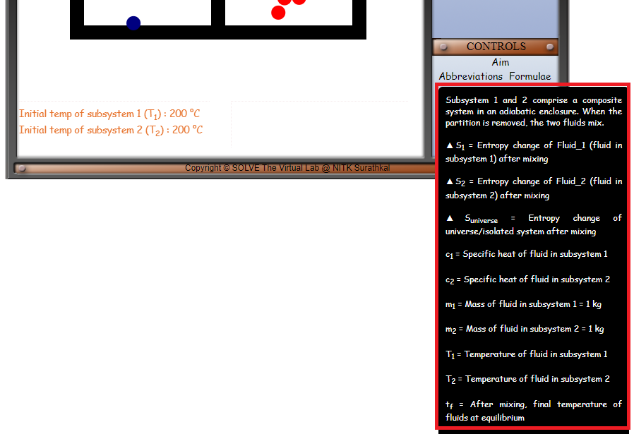
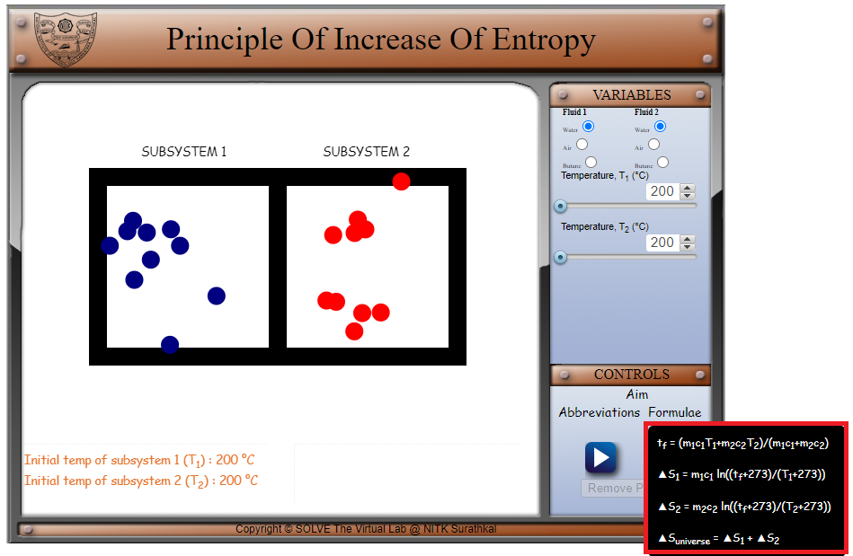
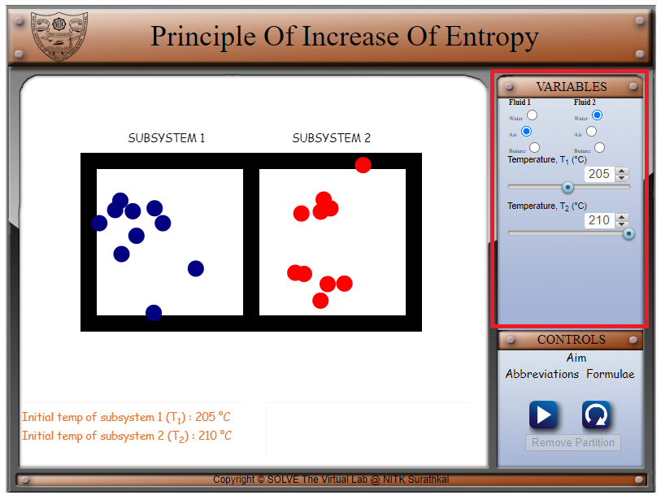
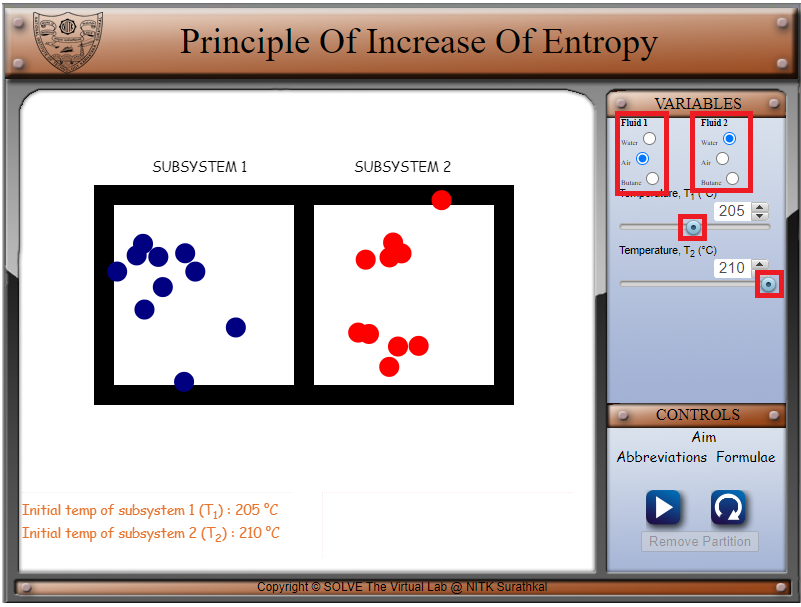
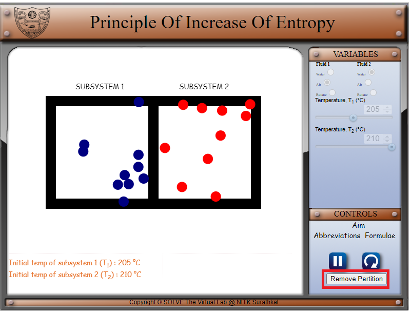
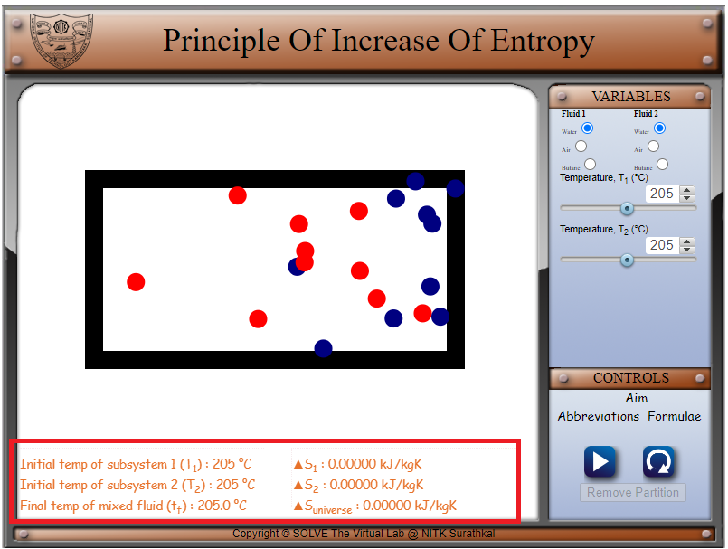

#### These procedure steps will be followed on the simulator

1. In the simulation window, two subsystems filled with moving balls are available. 

2. The aim, the abbreviations and the formulae involved in the second law of thermodynamics are mentioned in the controls tab. 

 

 

 

3. The parameters of the system can be varied in the Variables tab. 

 

4. Use the radio buttons to change the fluids of subsystems 1 and 2 and use the slider to vary T1 and T2 between 200 to 210℃. 

 

5. Use the "Remove Partition" button to remove the partition between the two subsystems. 

 

6. T1, T2, tf, ΔSuniverse, ΔS1 and ΔS2 are displayed in the box below. 

 
