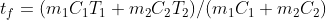
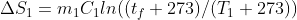
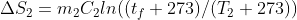
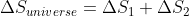

## INTRODUCTION 

Entropy is a measure of the molecular disorder or the randomness of the system. The second law of thermodynamics implies that as time increases, this disorder increases.

#### User Objectives and Goals: 

1. Understand the second law of thermodynamics and its implications for the entropy of the universe.
2. Visualize the change in the subsystems as the parameters are changed.
3. Calculate ΔSuniverse.
4. Infer the positive nature of the change in entropy from the calculations.

#### Theory 

The second law of thermodynamics states that the state of entropy of the entire universe as an isolated system will always increase over time. It says that the change in entropy in the universe can never be negative.

Entropy is a measure of the molecular disorder or the randomness of the system. The second law of thermodynamics implies that as time increases, this disorder increases.

This experiment depicts the second law of thermodynamics with the help of two subsystems consisting of balls to show that ΔSuniverse>=0.

#### Abbreviations: 

1. ΔS1 = Entropy change in fluid 1 after mixing

2. ΔS2 = Entropy change in fluid 2 after mixing

3. ΔSuniverse = Entropy change in the universe or the isolated system after mixing

4. C1 = Specific heat of fluid in subsystem 1

5. C2 = Specific heat of fluid in subsystem 2

6. m1 = Mass of fluid in subsystem 1 = 1 kg

7. m2 = Mass of fluid in subsystem 2 = 1 kg

8. T1 = Temperature of fluid in subsystem 1

9. T2 = Temperature of fluid in subsystem 2

10. tf = After mixing, the final temperature of fluids at equilibrium

#### Equations/formulae: 

 

 

 

 

 

 

 

 
