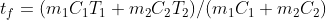
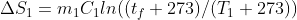
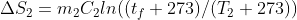
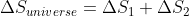
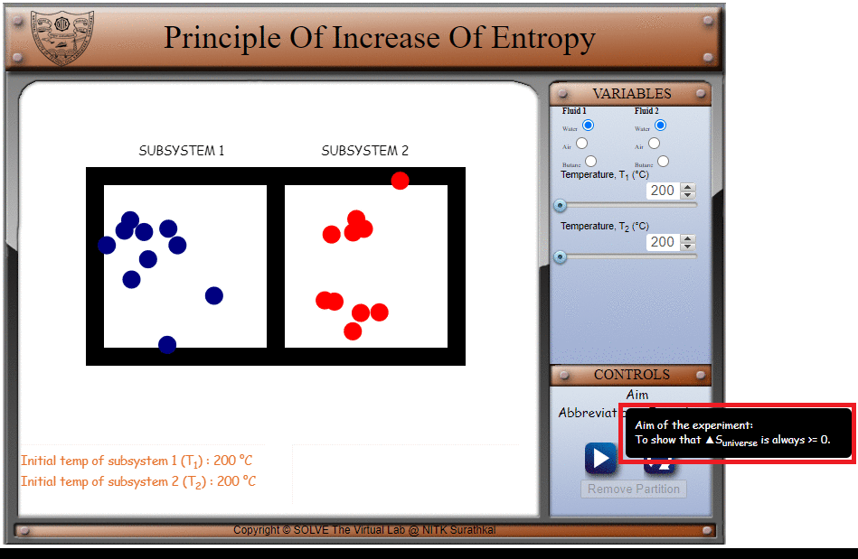

## Storyboard (Round 2)

Experiment: Stirling Cycle

**1. Story Outline**:

The second law of thermodynamics states that the state of entropy of the entire universe as an isolated system will always increase over time. It says that the change in entropy in the universe can never be negative.

Entropy is a measure of the molecular disorder or the randomness of the system. The second law of thermodynamics implies that as time increases, this disorder increases.

This experiment depicts the second law of thermodynamics with the help of two subsystems consisting of balls to show that ΔSuniverse>=0.

 **2. Story**:

  **2.1 Set the visual stage description**:

  The experiment consists of two subsystems filled with red and blue balls that have a removable partition between them. All the buttons and parameters are present on the right side of the frame. The variable panel consists of radio buttons to choose the type of fluid for each of the two subsystems and sliders for the temperatures of the two subsystems.

  The setup consists of two rectangles with a shared side that behaves as a partition. Within the first rectangle that behaves as subsystem 1, there are blue moving balls. Within the second rectangle that behaves as subsystem 2, there are red moving balls. When the partition is removed, balls in both the systems mix.

  By changing the temperature of the fluids, the speed (and hence, the entropy) of the system changes. When the partition is removed, it shows that the entropy difference between the two subsystems is positive.

  **2.2 Set User Objectives & Goals**:

* Understand the second law of thermodynamics and its implications for the entropy of the universe.
* Visualize the change in the subsystems as the parameters are changed.
* Calculate ΔSuniverse.
* Infer the positive nature of the change in entropy from the calculations.

  **2.3 Set the pathway activities**:

1. The initial T1 is taken as 200℃.
2. The initial T2 is taken as 200℃.
3. The initial Fluid 1 is taken as water.
4. The initial Fluid 2 is taken as water.
5. T1 can be varied from 200℃ to 210℃ using a slider.
6. T2 can be varied from 200℃ to 210℃ using a slider.
7. Fluid 1 can be chosen as Water, Air or Butane using the radio buttons.
8. Fluid 2 can be chosen as Water, Air or Butane using the radio buttons.

  **2.4 Set Challenges and Questions/Complexity/variation**

  **2.4.a Questions before simulation**:

    1. The second law of thermodynamics states that the change in entropy of the universe can never be:

      <ol type="a">
     <li>Positive</li>
     <li>Negative</li>
     <li>Constant</li>
     </ol>

     Answer: b

    2. The two subsystems with the fluids are kept in a _______ enclosure.

    <ol type="a">
    <li>Isothermal</li>
    <li>Adiabatic</li>
    <li>Isentropic</li>
    <li>None of the above</li>
    </ol>

    Answer: b

    3. The final temperature of the fluids after mixing when it is at equilibrium is given by the formula:

    <ol type="a">
    <li>tf = m1C1T1/m2C2</li>
    <li>tf = m2C2T2/m1C1</li>
    <li>tf = (m1C1T1 + m2C2T2)/(m1C1 + m2C2)</li>
    <li>tf = (m1C1T2 + m2C2T1)/(m1C1 + m2C2)</li>
    </ol>

    Answer: c

    4. Change in the entropy of the universe is given by the formula:

     <ol type="a">
    <li>ΔSuniverse = ΔS1 + ΔS2</li>
    <li>ΔSuniverse = ΔS1 - ΔS2</li>
    <li>ΔSuniverse = ΔS2 - ΔS1</li>
    <li>None of the above</li>
    </ol>

    Answer: a

**2.4.b Questions after simulation**

1. An ideal gas undergoes a process from State 1 (300K, 100kPa) to State 2 (600K, 500kPa). The specific heats of the ideal gas are Cp = 1 kJ/kgK and Cv = 0.7 kJ/kgK. The change in entropy of the ideal gas from State 1 to State 2 is:

<ol type="a">
<li>0.13</li>
<li>0.21</li>
<li>0.27</li>
<li>0.34</li>
</ol>
Answer: b

2. 1 kg of an ideal gas undergoes an irreversible process from State 1 (1 bar, 300 K) to State 2 (2 bar, 300 K). The change in specific entropy (s2 - s1) of the gas in the process is:

<ol type="a">
<li>-199</li>
<li>-210</li>
<li>-187</li>
<li> None of the above</li>
</ol>

Answer: a

3. Consider the fluid in subsystem 1 to be butane of mass 1 kg and the fluid in subsystem 2 to be water with mass 1 kg. Let T1 be 200℃ and T2 be 205℃. When the partition is removed, what is the temperature of the mixed fluid at equilibrium?

<ol type="a">
<li>202.5℃</li>
<li>201.6℃</li>
<li>203.95℃</li>
<li>203.2℃</li>
</ol>

Answer: d

4. Consider the fluids in both the subsystems to be water with mass 1 kg each. Let T1 be 200℃ and T2 be 205℃. When the partition is removed, what is the change in entropy of the universe?

<ol type="a">
<li>0.012 kJ/kgK</li>
<li>0.12 kJ/kgK</li>
<li>0.00012 kJ/kgK</li>
<li>0.000012 kJ/kgK</li>
</ol>

Answer: c

**2.5 Allow pitfalls: NA**

**2.6 Conclusion**:

The time taken to perform the virtual experiment.

The approximate time taken to understand the third law of thermodynamics and the procedure of the experiment would be 5 mins. The time taken to perform the experiment and notice the changes in the subsystems by varying the parameters would be 5 mins. The time taken to calculate ΔSuniverse would be 5 mins. Therefore, the total time taken to perform the virtual experiment is 15 mins.

**2.7a Abbreviations:**

1. ΔS1 = Entropy change in fluid 1 after mixing

2. ΔS2 = Entropy change in fluid 2 after mixing

3. ΔSuniverse = Entropy change in the universe or the isolated system after mixing

4. C1 = Specific heat of fluid in subsystem 1

5. C2 = Specific heat of fluid in subsystem 2

6. m1 = Mass of fluid in subsystem 1 = 1 kg

7. m2 = Mass of fluid in subsystem 2 = 1 kg

8. T1 = Temperature of fluid in subsystem 1

9. T2 = Temperature of fluid in subsystem 2

10. tf = After mixing, the final temperature of fluids at equilibrium

**2.7b Equations/formulae:**

 

 

 

 

 

 

 

 

 

<!-- # Below are the examples added for reference.
# To get mathematical equatios in html format: go to link: https://www.codecogs.com/latex/eqneditor.php and download equations in png format
# In the same link you have option to download equation as punching

### using png -->
<!--
//markdown syntax -->

<!-- //html syntax

 -->

**3. Flowchart**:

**4. Mindmap**:

**5. storyboard**:
1. In the simulation window, two subsystems filled with moving balls are available.
2. The aim, the abbreviations and the formulae involved in the second law of thermodynamics are mentioned in the controls tab.
3. The parameters of the system can be varied in the Variables tab.
4. Use the radio buttons to change the fluids of subsystems 1 and 2 and use the slider to vary T1 and T2 between 200 to 210℃.
5. Use the remove partition button to remove the partition between the two subsystems.
6. T1, T2, tf, ΔSuniverse, ΔS1 and ΔS2 are displayed in the box below.

**6. References**:

Basic and Applied Thermodynamics - P.K. Nag
Thermodynamics: An Engineering Approach - Yunus A Cengel, Michael A Boles
